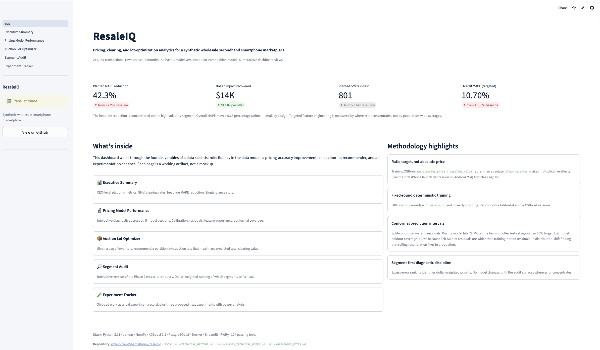
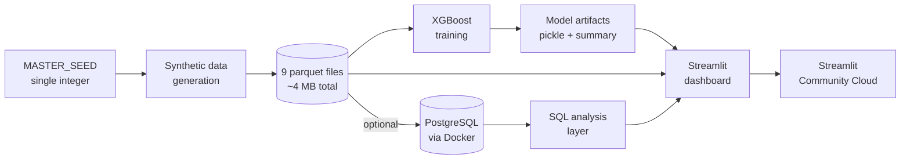

# ResaleIQ

A reference implementation of pricing accuracy and auction lot optimization on a synthetic secondhand smartphone marketplace.

[](https://github.com/ShamsRupak/resaleiq/actions/workflows/ci.yml)
[](LICENSE)
[](https://www.python.org/downloads/release/python-3110/)
[](https://resaleiq.streamlit.app/)

**Try it live:** [resaleiq.streamlit.app](https://resaleiq.streamlit.app/)



## Problem statement

Wholesale pre-owned mobile device marketplaces operate under two structural pressures. First, clearing prices for individual SKUs vary systematically with device category, condition grade, carrier compatibility, and time-of-year factors like flagship launch cycles. A pricing model that misses any of these produces quotes that are either too high (offers go unaccepted) or too low (revenue left on the table). Second, auction lots bundle many SKUs at once, and the total clearing price depends on the partition chosen — the same inventory split one way can clear materially higher than when split another way. Both problems reward segment-level diagnostics and careful feature engineering far more than they reward architectural novelty.

## What this project demonstrates

- **End-to-end ML pipeline** from seeded synthetic data generation through feature engineering, training, evaluation, deployment, and monitoring.
- **Segment-specific MAPE improvement methodology** that identifies where error concentrates and applies targeted feature engineering rather than population-wide architecture changes.
- **Auction lot composition optimization** under realistic market dynamics including popcorn-style end-of-auction bid extensions, proxy bidding, and reserve prices.

## Results snapshot

| Metric | Value | Note |
|---|---|---|
| Overall pricing MAPE | 11.35% to 10.70% | Population-wide, XGBoost baseline to targeted |
| Segment-specific MAPE | 27.15% to 15.68% | 42.3% relative reduction on planted error segment |
| Dollar error recovered | $13.7K across 801 planted test offers | Counterfactual analysis vs baseline model |
| Conformal interval coverage (pricing) | 80.3% on test set | 80% target, split-conformal on ratio residuals |
| Lot model out-of-sample MAPE | 3.97% on 531 held-out lots | February to March 2026 temporal holdout |
| Lot model improvement vs naive | 78.1% | Out-of-sample, against total-baseline-value baseline |
| Generalization gap | 0.85 percentage points | In-sample 3.13% vs OOS 3.97% |
| Tests passing | 104 / 104 | 89 always pass, 15 require Postgres via Docker |

Segment-specific numbers demonstrate the targeted feature engineering approach. The overall MAPE moves only 0.65 percentage points by design: the point is to concentrate the fix where the error concentrates, not to improve the population average.

## Stack

| Component | Choice | Rationale |
|---|---|---|
| Language | Python 3.11 | Broad library support, mature ML tooling, stable typing features |
| Gradient boosting | XGBoost 2.1.x | Tabular with mixed types, native categorical support, deterministic under fixed seed, strong conformal tooling |
| Database | PostgreSQL 16 | CTEs, window functions, JSONB for flexible attributes, production-grade |
| Dashboard | Streamlit | Fast path to a polished interactive dashboard without a separate frontend build |
| Containerization | Docker via docker-compose | Reproducible Postgres without system-wide install |
| CI | GitHub Actions | Two-job pipeline covering unit tests, linting, typing, and dashboard smoke tests |
| Package manager | uv | 10x faster than pip, pyproject-native, no lockfile required for a repo this size |
| Linter + formatter | ruff | Single tool replaces black, flake8, isort, pydocstyle; 100x speed |
| Type checker | mypy | Non-strict profile avoids pandas-stubs noise while catching real errors |

## Quickstart

From a clean clone:

```bash
git clone https://github.com/ShamsRupak/resaleiq.git
cd resaleiq
uv sync --all-extras
make generate
make test
make dashboard
```

The `make generate` step writes nine parquet files to `data/` in roughly 40 seconds. `make test` runs the 104-test suite (15 Postgres tests skip if Docker is unavailable). `make dashboard` launches Streamlit on port 8501.

To run the full pipeline including Postgres and all SQL queries:

```bash
make db-up
make db-load
make phase3-all
make lot-train
```

## Architecture



Data flow is strictly forward: the seed determines the parquets, the parquets feed training and SQL, training produces artifacts, and the dashboard reads from parquets and artifacts. No stage writes backward. The pipeline is deterministic end-to-end.

## Data generation philosophy

The synthetic dataset is transparent about its structure. It includes a planted cross-brand substitution effect during iPhone launch seasons: in September and October of each year, Android mid-tier device clearing prices are systematically depressed by a mean of 20 percent relative to the rest of the year. This is designed to reward feature engineering over model complexity, and mirrors the kind of structural error pattern a production pricing ML pipeline would diagnose and correct through segment-level work.

All of this is disclosed upfront. The point is not to hide a pattern but to provide a realistic segment-diagnostics workflow on reproducible data. The full list of embedded effects, including launch seasonality, grade-based dispersion, and buyer-tier behavior, lives in `src/resaleiq/data_generation/market_dynamics.py` with inline documentation.

## Project structure

```
resaleiq/
├── src/resaleiq/              # Core Python package
│   ├── config.py              # Central configuration and MASTER_SEED
│   ├── data_generation/       # 8 deterministic generators
│   ├── ml/                    # Features, training, evaluation, lot model
│   ├── sql/                   # 4 CTE-based analytical queries
│   └── db/                    # Postgres schema and psycopg 3 loader
├── scripts/                   # CLI entry points for training and loading
├── dashboard/                 # Streamlit multi-page application
│   ├── app.py                 # Landing page
│   └── pages/                 # 5 interactive diagnostic pages
├── tests/                     # 104 tests organized by layer
├── docs/                      # Model card, technical writeups, monitoring spec
├── data/                      # Committed parquets (4 MB) for Streamlit Cloud
├── migrations/                # Postgres migrations
├── docker-compose.yml         # Postgres 16 on port 5432
├── Makefile                   # Standardized task runner
├── pyproject.toml             # Dependencies, ruff, mypy configuration
└── .github/workflows/ci.yml   # Two-job CI pipeline
```

## Documentation map

| Document | Contents |
|---|---|
| [`docs/TECHNICAL_WRITEUP.md`](docs/TECHNICAL_WRITEUP.md) | Architecture decisions, seed hierarchy, target-type rationale |
| [`docs/PHASE3_TECHNICAL_NOTES.md`](docs/PHASE3_TECHNICAL_NOTES.md) | Feature ablation, conformal intervals, reproducibility tolerances |
| [`docs/MODEL_CARD.md`](docs/MODEL_CARD.md) | Lot-composition model card with OOS disclosure |
| [`docs/DASHBOARD_NOTES.md`](docs/DASHBOARD_NOTES.md) | Page-by-page design rationale |
| [`docs/DEPLOYMENT_PLAN.md`](docs/DEPLOYMENT_PLAN.md) | Production rollout sketch |
| [`docs/MONITORING_SPEC.md`](docs/MONITORING_SPEC.md) | Three-tier monitoring architecture |
| [`CONTRIBUTING.md`](CONTRIBUTING.md) | Development workflow, code style, quality gates |

## Reproducibility

Every number in this repository is reproducible from a single random seed.

- `MASTER_SEED = 20260420` in `src/resaleiq/config.py`
- Expected parquet rows: 77 devices, 4,675 SKUs, 400 buyers, 20,000 listings, 64,876 offers, 8,000 lots, 40,337 lot items, 37,599 lot bids, 39,823 model predictions
- Expected test count: 104 collected, 89 pass without Docker, 104 pass with Postgres available
- Cross-platform numerical variance: approximately ±0.05 percentage points on MAPE values due to XGBoost histogram binning float-ordering differences between platforms. Retrains on the same machine are bit-identical.

Full reproducibility requires: Python 3.11, XGBoost 2.1.x, deterministic flags `nthread=1` and fixed 500 boost rounds with early stopping disabled, plus the MASTER_SEED.

## License

MIT. See [`LICENSE`](LICENSE).

Built by Shams Rupak. [github.com/ShamsRupak](https://github.com/ShamsRupak) · [resaleiq.streamlit.app](https://resaleiq.streamlit.app/)
